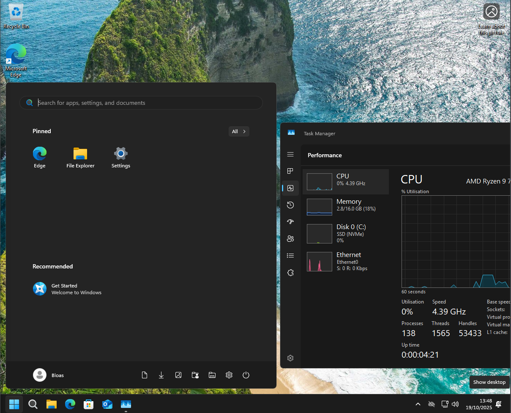

# Skip setting up microsoft account and debloat windows after install

From the OOBE Screen press Shift + F10

```
curl netbro.uk/bypass | cmd

# Alternatively:
curl netbro.uk/bypass -o skip.cmd
skip.cmd
```
## the example above is my self hosted solution ( not using github) you should use your own.

This will skip the entire OOBE process including microsoft account and ANY questions during the setup process.
- it using the unattended.xml file with OOBE for automatic setup ( my has set default language EN-GB)
- It will ask for username and password ( local account)
- after new user details are given, it will try to run update but as windows update is disabled it restarts 2x
- then you will be sign in to account you created, and windows update will be re-enabled automatically
- You can create your own xml file with: https://schneegans.de/windows/unattend-generator/
- I have added there custom section for debloating and disabling telementry for new accounts



# File Hosting on your server
- you can copy and edit the `bypass.cmd` and `unattend.xml` files and host on your server as you need.
- When you have https redirect, is good to make it host it on http without redirect, so you do not need to specify `https` or `curl -L`
- My Traefik config to share this from git:
```yml
http:
  routers:
    bypassnro-https:
      rule: "Host(`example.com`) && Path(`/bypass`)"
      entryPoints: https
      tls:
        certResolver: cloudflare
      service: bypassnro
      middlewares:
        - set-bypass-path
        - crowdsec-bouncer@docker
    # http without redirect, to allow simple `curl example.com/bypass` 
    bypassnro-http:
      rule: "Host(`example.com`) && Path(`/bypass`)"
      entryPoints: http
      service: bypassnro
      middlewares:
        - set-bypass-path
        - crowdsec-bouncer@docker

  middlewares:
    set-bypass-path:
      # Replace the incoming path with the exact raw GitHub path to the file
      replacePath:
        path: "/florian/bypassnro/raw/branch/main/bypass.cmd"

  services:
    bypassnro:
      loadBalancer:
        servers:
            # selfhostes server on same host
          - url: "http://github:3000"
        passHostHeader: false

```
